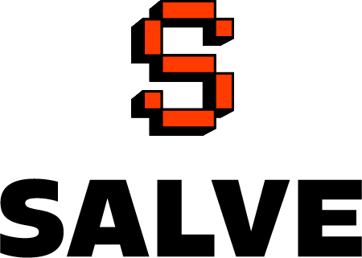

# INTRODUÇÃO

<figure><figcaption></figcaption></figure>


Leia com atenção todas as regras! As mesmas foram feitas com intuito de ajudar a manter um ambiente de RP saudável, e não com intuito punitivo! Separe alguns minutos do seu tempo para ler todas as regras antes de fazer seu primeiro login no servidor!


Regras atualizadas dia 30/09/2026

### Requisitos básicos para jogar no Salve

* Idade mínima de 18 anos, pois estamos de acordo com todas as condutas importas pela Rockstar Games e pelo FiveM. (Dúvidas sobre isso? [Clique aqui](https://runtime.fivem.net/platform-license-agreement-12-sept-2023.pdf))&#x20;
* Não possuir qualquer tipo de modificação gráfica que traga vantagens! Permitidos apenas modificadores gráficos como por exemplo QuantV ou NVE.&#x20;
* Ter conhecimento de todas as regras do servidor.&#x20;

O nosso servidor foi feito com o único intuito de divertir seus jogadores e construir uma comunidade saudável e sólida, com isso, algumas regras fundamentais precisam ser seguidas.

> <mark style="color:$danger;">ATENÇÃO: ao jogar no Salve, você automaticamente autoriza o uso da sua imagem e da sua voz em clipes gerados pelo servidor e pela sua comunidade.</mark>

