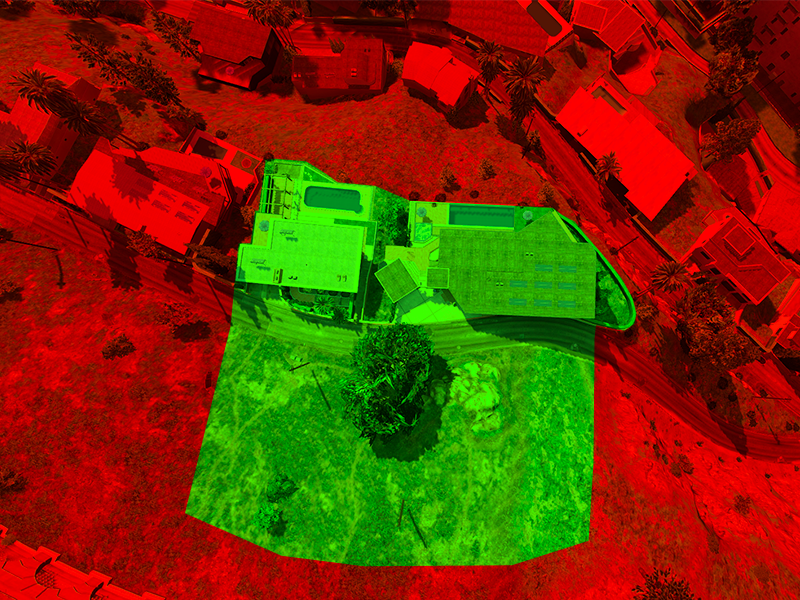
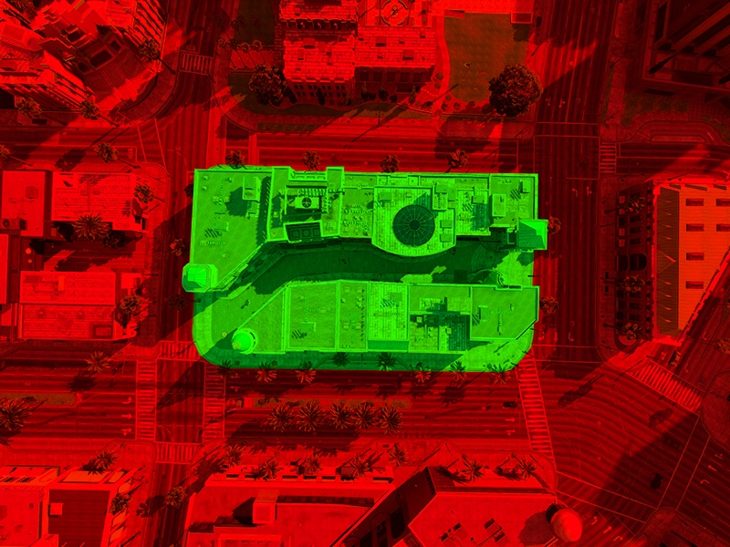

# REGRAS DE AÇÃO

## Regras Gerais de Ações

* Proibido o uso de drone por personagens que não são policiais.
* Proibido a utilização de k9 em qualquer tipo de ação.
* Proibido iniciar qualquer ação faltando menos de 30 minutos para o RR (reinício do servidor).&#x20;
* Proibido voltar para qualquer ação depois de desmaiar, mesmo que seja ressuscitado por algum médico ou bombeiro.
* Qualquer ação que envolva troca de tiros com a polícia em ações não blipadas e os bandidos cairem, a polícia deve aguardar uma unidade médica e da Polícia Civil para declarar o óbito do bandido, forçando o mesmo a respawnar no hospital. Caso não tenha médico online e/ou policial civil (ou os mesmos não consigam atender), a polícia pode declarar o óbito e colocar o bandido no saco preto (isso não configura PD).
* Permitido o policial decidir se vai declarar o óbito do bandido, ou reanimar o mesmo e seguir com o RP de prisão.
* Permitido lootear celulares, armas e chaves em **APENAS** situações de sequestro / indagação onde haja contexto no RP para tal atitude.

## Regras de Ações Fechadas (Blipadas)

* Proibido lootear veículos em ações fechadas.
* Proibido uso de drones em ações ( exceto policiais em coleta de evidência / investigação que não estejam participando da ação).
* Permitido lootear players em ações fechadas apenas os seguintes itens: alimentos em geral, munições, armamentos, coletes e kit médicos.&#x20;
* Proibido lootear celulares em ações fechadas a qualquer momento.
* **LOOT DE PLAYERS EM AÇÕES FECHADAS:** após lootear ou revistar um player (policial ou bandido), o player que looteou (policial ou bandido) deve executar ou declarar óbito no mesmo (usando a tecla "alt") para manda-lo ao hospital. Caso o player não seja executado ou tenha o óbito declarado por algum motivo, o mesmo deve ir de /GG após o tempo de espera.
* Proibido usar o /doctor em ações fechadas.&#x20;
* Ao final da ação, caso os bandidos ganhem, é **OBRIGATÓRIO** os bandidos saírem do local o mais rápido possível.
* Em ações **BLIPADAS OU FECHADAS**, proibido envolver pessoas de fora além das que começaram na ação.
* Em ações com reféns, proibido começar a ação sem estar com **TODOS OS REFÉNS** dentro do local que está sendo roubado.
* <mark style="color:red;">**PROIBIDO**</mark> usar paraquedas para acessar locais onde é impossível acesso sem algum tipo de transporte.&#x20;

## Ação de Contrabando de Veículos para o Paraguai

* Número máximo de bandidos: sem limites.
* Número máximo de policiais: sem limites.
* Bandidos que vão participar da ação devem estar presentes no local de roubo do veículo.
* Ação com foco em fuga.
* Proibido envolver pessoas de fora além das que começaram na ação.
* Proibido o bate-bate entre os carros da polícia e do bandido.
* Proibido usar carros para derrubar motos (caso aconteça, armas estão liberadas).
* Caso o bandido resolva atirar contra a polícia, vira ação de rua e a polícia reagir com contingente máximo.

## AÇÃO COLETA DE ITENS DO CRAFT

**Objetivo**

Realizar a coleta de itens de craft contidos em contêiners.&#x20;

**Funcionamento**

O contêiner deverá ser aberto por proximidade. A ação é iniciada no momento em que um grupo ou um indivíduo se aproxima do contêiner.

**Contestação**&#x20;

Após o início da ação, qualquer grupo poderá contestá-la. A contestação ocorrerá obrigatoriamente por meio da neutralização ou tentativa de neutralização do personagem que iniciou a ação. ( Não ataque qualquer um só porque se aproximou, isso será caracterizado RDM, é necessário que haja a animação de abertura ou avise antes para se afastar ).&#x20;

**Reação**&#x20;

O grupo que estiver realizando a abertura ou já estiver de posse dos itens contido no contêiner só poderá reagir se houver investida com verbalização ou ataque. O confronto permanecerá válido até que um dos grupos obtenha o controle da ação, seja por meio de neutralização ou fuga do adversário.&#x20;

**Loot**&#x20;

É terminantemente proibido realizar qualquer tipo de loot durante a ação. Também não será permitido loot após o encerramento do confronto, independentemente de qual grupo seja o vencedor da ação. Sempre grave a ação para comprovação do cumprimento das regras ou em caso de denúncia.

_**O descumprimento de qualquer uma das regras acima estará sujeito às sanções previstas pela administração em regras de ação.**_

## Ação Roubo a Loja de Conveniência

### Criminosos 

Número máximo de bandidos: 4 \
Armamento: obrigatório apenas **pistolas**\
**Proibido usar helicópteros nessa ação**\
\
**Regras dos Bandidos**

* Roubar cofre da loja.
* Bandidos devem proteger o cofre pois a polícia pode interromper a ação a qualquer momento.
* Bandidos podem abrir fogo na polícia assim que avistarem uma viatura.
* **OBRIGATÓRIO** 2 bandidos no interior da loja até o cofre ser aberto. Depois que pegar o dinheiro, está liberado sair.
* **PROIBIDO** fechar a porta da loja com carro com a intenção de bloquear a passagem da polícia
* <mark style="color:$danger;">**NÃO É NECESSÁRIO NEGOCIAR.**</mark>

### Policia 

Número máximo de policiais: 4\
Armamento: obrigatório apenas **pistolas**\
**Proibido usar helicópteros nessa ação**\
\
**Objetivo da Policia**

* Interromper a ação cancelando o processo de abertura do cofre.
* Neutralizar os bandidos que estão roubando a loja.
* **A polícia não precisa abater os bandidos para cancelar o roubo, se não tiver dentro da loja, eles podem cancelar direto!**

<mark style="color:$danger;">**ESSA AÇÃO DEVE SER FEITA APENAS NO TIRO**</mark>\
\ <mark style="color:$danger;">**NÃO PRECISA TER REFÉM!!!**</mark>

### Perímetro

Lojinha do Grajaú

<figure><figcaption></figcaption></figure>

Lojinha da Liberdade

<figure><figcaption></figcaption></figure>

Lojinha da Vila Alpina

<figure><figcaption></figcaption></figure>

## Ação de Roubo a Casa do Coreano

## Criminosos

Número máximo de bandidos: 6\
Armamento: obrigatório apenas **pistolas**\
**Proibido usar helicópteros nessa ação**

**Regras dos Bandidos**

* Roubar o dinheiro no cofre da mansão.
* Bandidos devem proteger o cofre pois a polícia pode interromper a ação a qualquer momento.
* Bandidos podem abrir fogo na polícia assim que avistarem uma viatura.
* **OBRIGATÓRIO** 3 bandidos no interior da mansão até o cofre ser aberto. Depois que pegar o dinheiro, está liberado sair.
* <mark style="color:red;">**NÃO É NECESSÁRIO NEGOCIAR.**</mark>

## Policia

Número máximo de policiais: 6\
Armamento: obrigatório apenas **pistolas**\
**Proibido usar helicópteros nessa ação**

**Objetivo da Policia**

* Interromper a ação cancelando o processo de hackeamento do cofre.
* Neutralizar os bandidos que estão roubando a mansão.
* **A polícia não precisa abater os bandidos para cancelar o roubo, se não tiver ninguém perto do cofre, eles podem cancelar direto!**

<mark style="color:red;">**ESSA AÇÃO DEVE SER FEITA APENAS NO TIRO**</mark>

<mark style="color:red;">**NÃO PRECISA TER REFÉM**</mark>

**Perímetro**

<figure><figcaption></figcaption></figure>

## Ação Roubo ao Carro Forte Protege

Número Máximo de Bandidos: sem limites.
\
Número Máximo de Policiais: sem limites.
\
Armamento: obrigatório qualquer arma de fogo.
\
Permitido o uso de helicópteros, porém proibido atirar a bordo deles.
\
Proibido reféns.
\
Obrigatório trocar tiro com os seguranças do carro forte.
\
Proibido tentar render ou sequestrar os seguranças (foco dessa ação é trocar tiro).
\
Proibido ficar de campana próximo ao galpão do Protege em mogi.

## Ação de Roubo ao Banco

## Criminosos

Número máximo de bandidos: 8\
Armamento: obrigatório apenas **submetralhadoras**\
**Proibido usar helicópteros nessa ação**

**Regras dos Bandidos**

* Roubar o dinheiro no cofre do banco.
* Bandidos devem proteger o cofre pois a polícia pode interromper a ação a qualquer momento.
* Bandidos podem abrir fogo na polícia assim que avistarem uma viatura.
* **OBRIGATÓRIO** 4 bandidos no interior do banco até o cofre ser aberto. Depois que pegar o dinheiro, está liberado sair.
* <mark style="color:red;">**NÃO É NECESSÁRIO NEGOCIAR.**</mark>

## Policia

Número máximo de policiais: 8\
Armamento: obrigatório o uso das armas: **IMBEL IA2 e APC .40**\
**Proibido usar helicópteros nessa ação**

**Objetivo da Policia**

* Interromper a ação cancelando o processo de hackeamento do cofre.
* Neutralizar os bandidos que estão roubando o banco.
* **A polícia não precisa abater os bandidos para cancelar o roubo, se não tiver ninguém perto do cofre, eles podem cancelar direto!**

<mark style="color:red;">**ESSA AÇÃO DEVE SER FEITA APENAS NO TIRO**</mark>

<mark style="color:red;">**NÃO PRECISA TER REFÉM**</mark>

**Perímetro:** nessa ação, o perímetro válido é o circulo formado pelo script ao iniciar a ação.

## Ação de domínio de Biqueira

**Regras da Ação**

* Deverá deixar claro para o rival que é uma disputa de boca;
* O conflito deverá acontecer nas imediações da área em disputa
* Permitido o uso de armamento **classe 1** ( pistolas e revólver ) e armas brancas
* Pode ter fuga, desde que o conflito não aconteça em outro lugar e quem fugiu declarou derrota
* Quando um grupo tentar atacar ou defender, caso perca ( morram todos na cena ), deverá deixar a área e retornar apenas no próximo RR.
* Só poderá defender a biqueira membros setados no mesmo grupo e atacar também, ou seja, proibido união de grupos para defesa ou ataque.

**Objetivos da Ação**

* Tomar o controle da área de domínio para coleta do recolhe.
* A polícia deve apresentar uma investigação com antecedência e a ação deve ser autorizada pela staff do servidor.

Caso a polícia presencie a ação, poderá interferir sem limitação de contingente e armamento.

## Ação Roubo ao Aeroporto de Congonhas

### Criminosos 

Número de bandidos: min 3 - max 6\
Armamento: obrigatório **1 arma de fogo** por bandido\
Número de carros: min 1 - max 3\
Número de refém: obrigatório apenas 1\
**Proibido usar helicópteros nessa ação**\
**Proibido usar motos nessa ação**\
\
**Regras dos Bandidos**

* Proibido fazer essa ação na troca de tiros.
* <mark style="color:$danger;">**Obrigatório negociar a fuga com a polícia.**</mark>
* Bandidos devem usar o refém para poder abrir a mala da viatura e pegar as barras de ouro.
* O refém pode ser usado pra negociar apenas a retirada do helicóptero ou a retirada da ROCAM (motos das polícia).
* Proibido tentar negociar qualquer outra coisa.
* Caso a polícia não apareça até a abertura da viatura, o refém deve ser liberado e os bandidos podem ir embora.
* Os bandidos devem liberar o refém próximo ao veículo e sair do local rapidamente, evitando conversas desnecessárias.

<mark style="color:$danger;">**AÇÃO COM FOCO EM FUGAS. CASO O BANDIDO RESOLVA ABRIR FOGO DURANTE A FUGA, A POLÍCIA ESTÁ LIBERADA A USAR TODO O CONTINGENTE DISPONÍVEL.**</mark>

### Policia 

Número de policiais: 4 unidades por cada carro dos bandidos\
Armamento: obrigatório apenas **pistolas**\
\
**Regras da Polícia**

* Proibido fazer essa ação na troca de tiros.
* Permitido apenas 1 helicóptero, e ele deve contar como 1 unidade.
* Obrigatório colaborar com a negociação e aceitar o refém em troca de remover o helicóptero ou a ROCAM (motos da polícia).
* Proibido tentar abater os bandidos para encerrar a ação.
* Proibido a entrada de outras unidades na fuga a não ser as que iniciaram a ação.
* Proibido a polícia abrir fogo contra os bandidos durante a fuga, a não ser que os mesmos tomem a iniciativa de iniciar uma troca de tiros.

<mark style="color:$danger;">**A NÃO COLABORAÇÃO COM AS REGRAS DA AÇÃO IRÁ RESULTAR EM PUNIÇÕES ADMINISTRATIVAS.**</mark>

## Ação de Roubo ao Banco Central

### Criminosos

Número de bandidos: min 10 - max 12\
Armamento: obrigatório **fuzil** (AK47 - AK74 - MP4)\
Número de refém: obrigatório apenas 1\
**Proibido usar helicópteros nessa ação**

**Objetivos dos Bandidos**

* Abrir cofre e garantir que a operação termine.
* Impedir que a polícia cancele a operação.
* Fugir com o dinheiro.

### Polícia

Número obrigatório de policiais: 12\
Armamento: obrigatório **fuzil** (Scar - Parafal)\
**Permitido 1 helicóptero**

**Objetivos da Polícia**

* Interromper a operação de roubo do cofre.
* Interceptar os bandidos.

**Regras da Ação**

* <mark style="color:$danger;">**OBRIGATÓRIO NEGOCIAÇÃO NESSA AÇÃO EM ESPECÍFICO!**</mark>
* Essa ação deve ser feita obrigatoriamente no **TIRO**, logo fica proibido negociar **FUGA**.
* É permitido apenas 2 bandidos do lado de fora do banco, o resto deve ficar dentro.
* Os bandidos poderão trocar o refém por: remoção do helicóptero ou remoção da bomba de gás. Não será permitido trocar o refém pela remoção dos 2 recursos. Escolha 1 dos 2.
* Proibido pedir dinheiro pelo refém.
* Policiais podem atirar do helicóptero.
* Policiais podem se unir para completar o número necessário para ação.
* Permitido uso de gás nessa ação.

**Perímetro:** nessa ação, o perímetro válido é o circulo formado pelo script ao iniciar a ação.

<mark style="color:$danger;">**ESSA AÇÃO DEVE SER FEITA APENAS NO TIRO!**</mark>

## Ação de Roubo a Joalheria no Jardim América

EM BREVE

## Criminosos

Número máximo de bandidos: 4\
Armamento: obrigatório apenas submetralhadoras (MP5, MP9, UZI e Draco)\
**Proibido usar helicópteros nessa ação**

**Regras dos Bandidos**

* Roubar o dinheiro no computador da joalheria.
* Bandidos devem proteger o cofre pois a polícia pode interromper a ação a qualquer momento.
* Bandidos podem abrir fogo na polícia assim que avistarem uma viatura.
* **OBRIGATÓRIO** 2 bandidos no interior da joalheria.
* **PROIBIDO** fechar a porta da joalheria com carro com a intenção de bloquear a passagem da polícia.
* <mark style="color:red;">**NÃO É NECESSÁRIO NEGOCIAR.**</mark>

## Policia

Número máximo de policiais: 4\
Armamento: obrigatório apenas submetralhadoras (IMBEL - IA2 e SUBMETRALHADORA B\&T)\
**Proibido usar helicópteros nessa ação**

**Objetivo da Policia**

* Interromper a ação cancelando o processo de abertura do cofre.
* Neutralizar os bandidos que estão roubando a joalheria.
* **A polícia não precisa abater os bandidos para cancelar o roubo, se não tiver dentro da loja, eles podem cancelar direto!**

<mark style="color:red;">**ESSA AÇÃO DEVE SER FEITA APENAS NO TIRO**</mark>

<mark style="color:red;">**NÃO PRECISA TER REFÉM**</mark>

**Perímetro**

<figure><figcaption></figcaption></figure>

